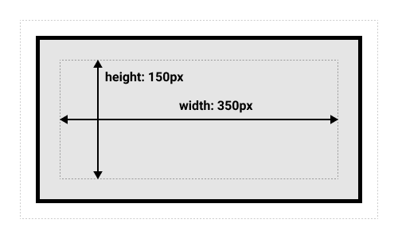

# 什么是CSS盒模型

- 根据 MDN 上的查阅，盒模型全称 **CSS 基础框盒模型（CSS basic box model）**。当对一个文档进行布局的时候，浏览器的渲染引擎会将所有元素表示为一个个矩形的盒子。CSS 决定这些盒子的大小、位置以及属性。
- CSS中组成一个块级盒子需要：
    - Content box: 这个区域是用来显示内容，大小可以通过设置 width 和 height.
    - Padding box: 包围在内容区域外部的空白区域，大小通过 padding 相关属性设置。
    - Border box: 边框盒包裹内容和内边距，大小通过 border 相关属性设置。
    - Margin box: 这是最外面的区域，是盒子和其他元素之间的空白区域，大小通过 margin 相关属性设置。


# 哪一种盒模型

- 在上面 CSS 盒子模型的默认定义中，对一个元素所设置的 width 与 height 只会应用到这个元素的内容区（content box）。如果这个元素有任何的 border 或 padding
  ，绘制到屏幕上时的盒子宽度和高度会加上设置的边框和内边距值。这意味着当你调整一个元素的宽度和高度时需要时刻注意到这个元素的边框和内边距。当我们实现响应式布局时，这个特点尤其烦人。
- CSS 中的 `box-sizing` 属性可以被用来调整这些表现:
    - `content-box`  
      默认值,标准盒子模型。 width 与 height 只包括内容的宽和高， 不包括 border，padding，margin。 假设定义了 width, height, margin, border, padding:

  ```css
  .box {
    width: 350px;
    height: 150px;
    margin: 25px;
    padding: 25px;
    border: 5px solid black;
    }
  ```
  元素实际宽度为350 + 25 + 25 + 5 + 5 = 410px
  

    - `border-box`  
      width 和 height 属性包括内容，padding 和 border，但不包括margin。
  ```css
  .box {
    box-sizing: border-box;
    width: 350px;
    height: 150px;
    margin: 25px;
    padding: 25px;
    border: 5px solid black;
    }
  ```
  元素实际宽度就是350px，不包含margin  
  
- 显然，`border-box`更好用。