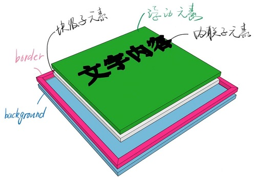
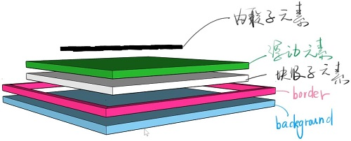
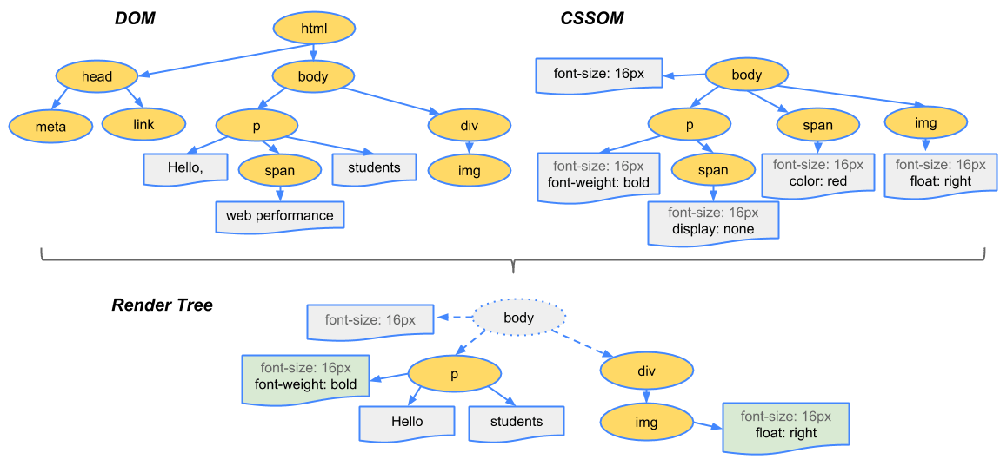

# 什么是CSS盒模型

- 根据 MDN 上的查阅，盒模型全称 **CSS 基础框盒模型（CSS basic box model）**。当对一个文档进行布局的时候，浏览器的渲染引擎会将所有元素表示为一个个矩形的盒子。CSS 决定这些盒子的大小、位置以及属性。
- CSS中组成一个块级盒子需要：
    - Content box: 这个区域是用来显示内容，大小可以通过设置 width 和 height.
    - Padding box: 包围在内容区域外部的空白区域，大小通过 padding 相关属性设置。
    - Border box: 边框盒包裹内容和内边距，大小通过 border 相关属性设置。
    - Margin box: 这是最外面的区域，是盒子和其他元素之间的空白区域，大小通过 margin 相关属性设置。

  

# 哪一种盒模型

- 在上面 CSS 盒子模型的默认定义中，对一个元素所设置的 width 与 height 只会应用到这个元素的内容区（content box）。如果这个元素有任何的 border 或 padding
  ，绘制到屏幕上时的盒子宽度和高度会加上设置的边框和内边距值。这意味着当你调整一个元素的宽度和高度时需要时刻注意到这个元素的边框和内边距。当我们实现响应式布局时，这个特点尤其烦人。
- CSS 中的 `box-sizing` 属性可以被用来调整这些表现:
    - `content-box`  
      默认值,标准盒子模型。 width 与 height 只包括内容的宽和高， 不包括 border，padding，margin。 假设定义了 width, height, margin, border, padding:

  ```css
  .box {
    width: 350px;
    height: 150px;
    margin: 25px;
    padding: 25px;
    border: 5px solid black;
    }
  ```
  元素实际宽度为350 + 25 + 25 + 5 + 5 = 410px

  

    - `border-box`  
      width 和 height 属性包括内容，padding 和 border，但不包括 margin。
  ```css
  .box {
    box-sizing: border-box;
    width: 350px;
    height: 150px;
    margin: 25px;
    padding: 25px;
    border: 5px solid black;
    }
  ```
  元素实际宽度就是350px，不包含margin  
  
- **显然，`border-box`更符合人的思维直觉，更好用**

# CSS布局

通过 CSS 改变 HTML 页面的原本的结构，把页面分成一块一块，按照从左到右或从上到下排列就叫做布局。尽量通过语义化的标签`<main>、<header>、<footer>、<nav>、<aside>` 等来配合
CSS布局，而不是一味地通过`<div>` + CSS来布局。

一般有三种布局：

- 固定宽度布局：一般宽度为 960 / 1000 / 1024 px
- 不固定宽度布局：文档流本身就是自适应的，可以靠文档流的原理来实现自适应布局
- 响应式布局：PC上固定宽度，手机上不固定宽度的一种混合布局

## 三种常见方案实现布局

### float

一种专门兼容IE的布局方案，主要是给元素添加浮动属性，让元素脱离文档流来达到想要的效果

- 通过给子元素添加`float:left`和 `width`
- 父元素添加`.clearfix`清除浮动

### flex

W3C 为了让布局变得更加效率而推出的一种弹性布局方案，flex 将元素划分为了 container 和 item，通过一系列属性轻松实现布局

- 父元素添加属性`display: flex; /* or inline-flex */`成为容器，通过不同属性来设置方向、换行间隙等等
    - `flex-direction`
    - `flex-wrap`
    - `justify-content`
    - `align-content`
- 子元素为 item，通过不同属性改变自己在布局中独特的样式
    - `align-self`
    - `order`

**[CSS-Tricks的guide](https://css-tricks.com/snippets/css/a-guide-to-flexbox/)**

### grid

功能最为强大的布局方案，如其名 grid 也就是网格，能同时实现水平和垂直方向的布局，但是只有最新的浏览器支持，兼容性不是很好

- 父元素添加属性`display: grid | inline-gird;`成为容器，通过各种属性来设置网格的行与列以及间隙等等
    - `grid-template-columns`
    - `grid-template-rows`
- 子元素通过各种属性来确定自身在父元素网格中所处的位置和宽高等等
    - `grid-column`
    - `grid-row`
    - `grid-area`

**[CSS-Tricks的guide](https://css-tricks.com/snippets/css/complete-guide-grid/)**

# CSS定位

定位不同于布局。笼统地说，布局是屏幕平面上的，只管屏幕的 X 轴和 Y 轴。而定位是垂直于屏幕的，决定了元素在 Z 轴上（虽然你看不见）的先后顺序。

### 一个 div 的分层

两图流

- 
- 

### position的五个取值

- `static` 默认值，即元素在文档流中当前的布局位置
- `relative` 相对定位，元素先放置在未添加定位时的位置，再在不改变页面布局的前提下调整元素位置（说人话就是先升起来，但不脱离文档流）
- `absolute` 绝对定位，元素会被移出正常文档流，并不为元素预留空间，**定位基准是最近的非 static 祖先元素**。
    - 绝对定位的元素可以设置外边距（margins），且不会与其他边距合并
- `fixed` 固定定位，同样会被移出文档流，且不为元素预留空间，定位基准是 viewport。元素的位置在屏幕滚动时不会改变。(bug很多，尽量别用)
    - 当元素祖先的 `transform`, `perspective` 或 `filter` 属性非 none 时，容器由视口改为该祖先
- `sticky` 粘性定位，可以被认为是相对定位和固定定位的混合。元素在跨越特定阈值前为相对定位，之后为固定定位（沾滞定位适配所有移动设备上的浏览器，但老的桌面浏览器不支持）

### 层叠上下文

我们假定用户正面向（浏览器）视窗或网页，而 HTML 元素沿着其相对于用户的一条虚构的 z 轴排开，层叠上下文就是对这些 HTML 元素的一个三维构想。众 HTML 元素基于其元素属性按照优先级顺序占据这个空间。

文档中几个主要形成**层叠上下文**的条件：

- 文档根元素`<html>`
- `position` 值为 `absolute` 或 `relative` 且 `z-index` 值不为 `auto` 的元素
- `position` 值为 `fixed` 或 `sticky` 的元素
- flex 容器的子元素，且 `z-index` 值不为 `auto`
- grid 容器的子元素，且 `z-index` 值不为 `auto`
- `opacity` 属性值小于 1 的元素
- `transformt` 不为 none 的元素

在层叠上下文中，子元素同样也按照上面解释的规则进行层叠。 重要的是，其子级层叠上下文的 z-index 值只在父级中才有意义。子级层叠上下文被自动视为父级层叠上下文的一个独立单元。 说人话就是每个层叠上下文就是一个新的小世界，这个小世界里的
`z-index` 跟外界无关，处在同一个小世界的 `z-index` 才能比较。


# 浏览器渲染原理

简要的浏览器渲染步骤：

1. 处理 HTML 标记并构建 DOM 树。
2. 处理 CSS 标记并构建 CSSOM 树。
3. 将 DOM 与 CSSOM 合并成一个渲染树。
4. 根据渲染树来布局，以计算每个节点的几何信息。
5. 将各个节点绘制到屏幕上。

## 构建对象模型

浏览器渲染页面前需要先构建 DOM 和 CSSOM 树。因此，我们需要确保尽快将 HTML 和 CSS 都提供给浏览器。

- 过程为：字节（Bytes）→字符（Characters）→令牌（Tokens）→节点（Nodes）→对象模型（DOM）

### 文档对象模型 (DOM)

- 浏览器每次处理 HTML 标记时，都会按照步骤: 将字节转换成字符，确定令牌，将令牌转换成节点，然后构建 DOM 树。这整个流程可能需要一些时间才能完成，有大量 HTML 需要处理时更是如此。

### CSS 对象模型 (CSSOM)

- CSS 字节转换成字符，接着转换成令牌和节点，最后链接到一个称为“CSS 对象模型”(CSSOM) 的树结构内

## 渲染树构建、布局及绘制

- 浏览器将 DOM 和 CSSOM 合并成一个“渲染树”，网罗网页上所有可见的 DOM 内容，以及每个节点的所有 CSSOM 样式信息。
- 布局流程的输出是一个“盒模型”，它会精确地捕获每个元素在视口内的确切位置和尺寸: 所有相对测量值都转换为屏幕上的绝对像素。
- 最后，既然我们知道了哪些节点可见、它们的计算样式以及几何信息，我们终于可以将这些信息传递给最后一个阶段: 将渲染树中的每个节点转换成屏幕上的实际像素。这一步通常称为“绘制”或“栅格化”。

# 渲染性能

## 像素管道：JS / CSS > 样式 > 布局 > 绘制 > 合成

这是像素至屏幕管道中的关键点：

- **JavaScript。** 一般来说，我们会使用 JavaScript 来实现一些视觉变化的效果。
- **样式计算。** 此过程是根据匹配选择器（例如 `.headline` 或 `.nav > .nav__item`）计算出哪些元素应用哪些 CSS 规则的过程。
- **布局。** 在知道对一个元素应用哪些规则之后，浏览器即可开始计算它要占据的空间大小及其在屏幕的位置。
- **绘制。** 绘制是填充像素的过程。它涉及绘出文本、颜色、图像、边框和阴影，基本上包括元素的每个可视部分。绘制一般是在多个表面（通常称为层）上完成的。
- **合成。** 由于页面的各部分可能被绘制到多层，由此它们需要按正确顺序绘制到屏幕上，以便正确渲染页面。对于与另一元素重叠的元素来说，这点特别重要，因为一个错误可能使一个元素错误地出现在另一个元素的上层。

不一定每帧都总是会经过管道每个部分的处理。实际上，不管是使用 JavaScript、CSS 还是网络动画，在实现视觉变化时，管道针对指定帧的运行通常有三种方式:

1. **JS / CSS > 样式 > 布局 > 绘制 > 合成**  
   如果您修改元素的“layout”属性，也就是改变了元素的几何属性（例如宽度、高度、左侧或顶部位置等），那么浏览器将必须检查所有其他元素，然后“自动重排”页面。任何受影响的部分都需要重新绘制，而且最终绘制的元素需进行合成。
2. **JS / CSS > 样式 > 绘制 > 合成**  
   如果您修改“paint only”属性（例如背景图片、文字颜色或阴影等），即不会影响页面布局的属性，则浏览器会跳过布局，但仍将执行绘制。
3. **JS / CSS > 样式 > 合成**  
   如果您更改一个既不要布局也不要绘制的属性，则浏览器将跳到只执行合成。  
   这个最后的版本开销最小，最适合于应用生命周期中的高压力点，例如动画或滚动。

- 性能最佳的像素管道版本会避免布局和绘制，只需要合成更改。为了实现此目标，需要坚持更改可以由合成器单独处理的属性。目前只有两个属性符合条件: `transforms` 和 `opacity`

# CSS动画

## `transform`

**位移** `transform: translate(npx, n%);`  
**缩放** `transform: scale(n);`  
**旋转** `transform: rotate(ndeg);`  
**倾斜** `transform: skew(X|Y)(ndeg);`

- 一般需要配合 `transition`过度
- inline 元素不支持 `transform`,需要先变成 block
- 绝对定位元素居中：

```css
div {
  position: absolute;
  left: 50%;
  top: 50%;
  transform: translate(-50%, -50%);
}
```

## `transition`

`transition`属性可以被指定为一个或多个 CSS 属性的过渡效果，多个属性之间用逗号进行分隔。

- `transition: 属性名 时长 过度方式 延迟`
- `transition: margin-right 4s ease-in-out 1s;`
- 常用过度方式有: linear（线性）| ease（默认值） | ease-in | ease-out | ease-in-out

## `animation`

### `keyframes`

关键帧` @keyframes` 通过在动画序列中定义关键帧的样式来控制CSS动画序列中的中间步骤。和`transition` 相比，`keyframes` 可以控制动画序列的中间步骤。有两种写法：

```css
@keyframes slidein {
  from {
    transform: translateX(0%);
  }
  to {
    transform: translateX(100%);
  }
}

@keyframes identifier {
  0% { top: 0; left: 0; }
  30% { top: 50px; }
  68%, 72% { left: 50px; }
  100% { top: 100px; left: 100%; }
}
```

### `animation`

`animation: 关键帧定义序列名 | 关键帧持续时长 | 过度方式 | 延迟 | 运行次数 | 方向 | 填充模式 | 是否暂停`

- 关键帧持续时长：6s或120ms
- 过度方式：参考`transition`，比如linear、ease
- 延迟：2s或4ms
- 运行次数：默认值为1，可以为0.5，也可写为infinite即无限循环
- 方向：normal | alternate | reverse | alternate-reverse
- 填充模式：none | forwards | backwards | both
- 是否暂停: paused | running

```css
#heart {
  animation: heart .5s ease-in-out infinite alternate-reverse;
}

@keyframes heart {
  0% {
    transform: scale(1);
  }
  100% {
    transform: scale(1.3);
  }
}
```