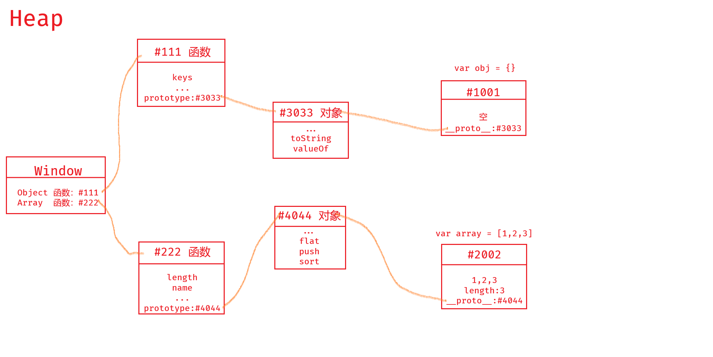

# JavaScript 对象

## 语法

Object 构造函数为给定值创建一个对象包装器。

```js
let obj = {'a': 'foo', 'b': 42, 'c': {}}
let obj2 = new Object({a: 'foo', b: 42, c: {}})
console.log({a: 'foo', b: 42, c: {}})
```

其中参数是键（key）值（value）对的集合，每个 key 都是对象的属性名（property），每个 value 都是对象的属性值。

- 键名是成对的名称，通过冒号与值分离，键名是**字符串**，即使省略了引号，键名依然是**字符串**。
- 键名如果有特殊规则比如中文或者含有空格，还是需要加引号。

```js
let obj = {
  2: 123,
  '': 0,
  ' ': 1,
  中文: 'zh'
}
// Object.keys(obj)
// ["2", "", " ", "中文"]

```

- 变量作为属性名，需要加`[]`，不然依然会变成字符串。

```js
let a = `xxx`
let obj = {[a]: 123}
// obj
// {xxx: 123}
```

## 对象的隐藏属性

在 JavaScript 中，几乎所有的对象都是`Object`类型的实例，它们都会从`Object.prototype`继承属性和方法。


- JavaScript中，每个对象都有一个隐藏属性（隐式原型）`__proto__`(`[[proto]]`)
- 这个隐藏属性储存着**共有属性组成的对象**的地址
- 这个共有属性组成的对象 叫做原型`prototype`

**套娃之对象的原型也是对象**，所以上图中`#4044`和`#3033`自身也有`__proto__`，也就是所谓原型共有的原型，但是指向的地址为`null`

```js
let obj = {}
console.dir(obj.__proto__.__proto__)
null
```

## 删除对象属性

使用`delete obj.x` 或 `delete obj['x']`，能删除对象的**属性名**和**属性值**

- `obj.x = undefined`只能让属性名为 x 的属性值变为 undefined，并不能删除属性名。

```js
let obj = {
  name: 'frank',
  age: 18
}
let obj2 = {
  name: 'jack',
  age: 19
}
delete obj.name
obj2.name = undefined
// obj
// {age: 18}
// obj2
// {name: undefined, age: 19}
```

- `'x' in obj === false`可以判断对象是否含有属性名
- `obj.x === undefined`不能断定`'x'`是否为 obj 的属性

```js
let obj = {}
let obj2 = {x: undefined}
obj.x === undefined
true
obj2.x === undefined
true
'x' in obj
false
'x' in obj2
true
```

## 读取对象属性

查看对象自身所有属性：

- `Object.keys()`返回一个包含所有给定对象自身可枚举属性名称的数组。
- `Object.values()`返回给定对象自身可枚举值的数组。
- `Object.entries()`返回给定对象自身可枚举属性的`[key, value]`数组。

如果需要查看对象的原型属性，可以使用`console.dir()`  
判断一个对象的属性是否为自身属性：`hasOwnProperty()`

两种方法查看个别属性：

- `obj['x']`（搞不清楚就用这一种，关键是切记key值一定是**字符串**）
- `obj.x`

```js
let obj = {name: 'ming', age: 5}
obj['name']
"ming"
obj.age
"5"
obj['na' + 'me']
"ming"
obj[console.log('name')]
name
undefined
```

**_难点_**：

```js
let list = ['name', 'age', 'gender']
let person = {name: 'frank', age: 18, gender: 'man'}
for (let i = 0; i < list.length; i++) {
  let name = list[i]
  console.log(person____)
} 
```

要让 person 的所有属性被打印出来，应该输入的是`console.log(person[name])`，~~console.log(person.name)~~

## 修改或写入对象属性

- 直接赋值

```js
let obj = {name: 'ming'}
obj.name = 'ming'
obj['name'] = 'ming'
```

- 批量赋值

```js
let obj = {name: 'ming'}
Object.assign(obj, {age: 18, gender: 'man'})
``` 

- 一般情况下无法修改或增加对象自身的共有属性

```js
let obj = {}
let obj2 = {}
obj.toString = 'xxx'/*只会修改obj的自身属性*/
// obj2.toString还是指向原型
```

如果非要修改原型：
`obj.__proto__.toString='xxx'`或`Object.prototype.toString='xxx'`  
总的来说作为学习使用，实际情况中不要修改原型，会引发诸多问题

- `Object.create()`方法创建一个新对象，使用现有的对象来提供新创建的对象的`__proto__`。

```js
let common = {'国籍': '中国', hairColor: 'black'}
let person = Object.create(common)
console.dir(person)
// Object
//  __Prototype__:Object
//    hairColor: "black"
//    国籍: "中国"
//    __Prototype__:Object
```